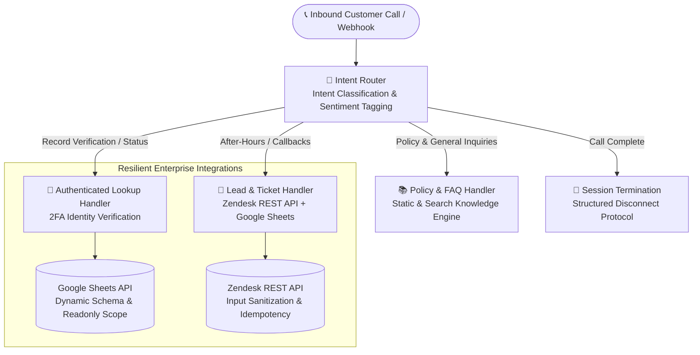
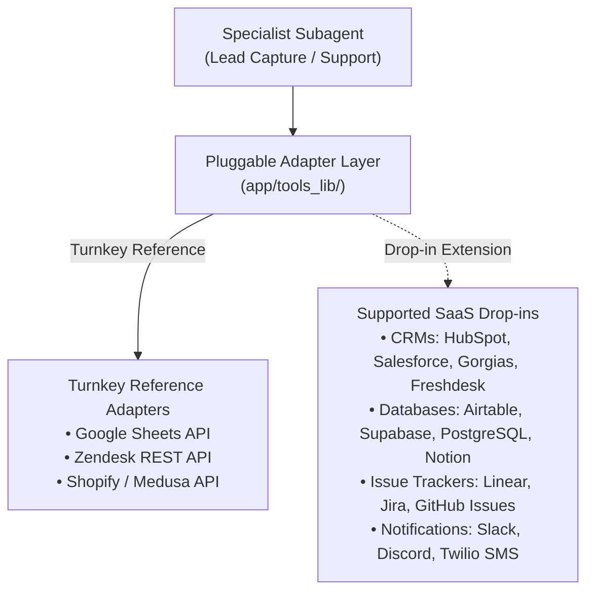

# 🎙️ Enterprise AI Telephony & Customer Service Webhook Template

[](https://www.python.org/downloads/)
[](https://google.github.io/agent-development-kit/)
[](https://cloud.google.com/vertex-ai)
[](tests/unit/)
[](tests/unit/)
[](LICENSE)

A modular, production-ready telephony webhook and conversational AI starter template built on **FastAPI**, **Google Agent Development Kit (ADK)**, and **Google Gemini Live** on Vertex AI.

Engineered as an extensible foundation for automated inbound phone systems across **any industry** (Healthcare, Legal, Real Estate, SaaS, Field Services, E-Commerce), the service handles four universal customer service workflows: intent classification, authenticated record lookups, policy Q&A, and CRM/spreadsheet dispatch.

---

## 🏛️ System Architecture & Request Flow

The service uses an intent-routing state machine to classify caller goals and dispatch tasks to specialized handlers with isolated context:



---

## 🏢 Universal Multi-Industry Adaptability

While the template includes a runnable e-commerce reference implementation (order tracking & product lead capture), its four modular pillars map directly to any business vertical:

| Industry / Vertical | 🔐 Authenticated Lookup Module | 📚 Policy & FAQ Module | 📝 Dispatch & Lead Capture Module |
| :--- | :--- | :--- | :--- |
| **Retail & E-Commerce** *(Default Example)* | Order status, carrier ETA via PO + ZIP | Returns, shipping timelines, warranties | After-hours callback, damaged item tickets |
| **Healthcare & Clinics** | Appointment confirmation via DOB + Phone | Insurance accepted, office hours, prep steps | Prescription refill callback, triage requests |
| **Legal & Financial** | Case status, claim updates via Case ID + PIN | Retainer policies, consultation pricing | Confidential intake form, attorney callback |
| **Real Estate & Property** | Showing status, tenant maintenance via Unit # | Lease terms, pet policies, amenities | Maintenance dispatch ticket, buyer lead capture |
| **SaaS & B2B Tech** | Subscription status, enterprise tier lookup | SLA terms, API limits, documentation | Priority escalation ticket, demo booking |
| **Field Services / Auto** | Service appointment status via Work Order # | Pricing estimates, service radius, hours | Emergency dispatch request, callback form |

---

## Pluggable SaaS Integration Architecture

While the template includes turnkey adapters for **Google Sheets**, **Zendesk**, and **Medusa/Shopify**, all tool capabilities are built on a decoupled adapter interface (`app/tools_lib/`) allowing drop-in integration with any third-party SaaS provider:



### Supported Integration Matrix

| Capability Domain | Turnkey Reference (Included) | Supported Drop-In Alternatives |
| :--- | :--- | :--- |
| **CRM & Ticketing** | Zendesk REST API | **HubSpot, Salesforce, Gorgias, Freshdesk, Linear** |
| **Lead Database** | Google Sheets API | **Airtable, Supabase, PostgreSQL, Notion API** |
| **E-Commerce & Orders** | Medusa / Shopify API | **WooCommerce, BigCommerce, Stripe Billing** |
| **Knowledge & FAQ** | Headless CMS (Contentful/Sanity) | **Notion Knowledge Base, Strapi, Custom RAG / Vector DB** |

---

## 🚀 Key Engineering Disciplines

### 1. 🔐 Two-Factor Authentication (2FA) for Customer Records
To prevent unauthorized disclosure of customer PII over voice telephony, record lookup handlers enforce strict two-factor verification:
- **Primary Identifier**: Telephony Caller ID, alternate customer phone number, or Reference ID (e.g. `PO-XXXXXX`, `CASE-XXXXX`).
- **Security Barrier**: 5-digit ZIP code, Last Name, or PIN verification.
- **Fast-Path Session Cache**: Pre-fetches record status upon handler entry, eliminating redundant network calls.

### 2. ⚡ Sub-Second Voice Turn Latency
- Prompts engineered with strict **<40-word constraints** and single-question mandates.
- Native Python client bindings for Google Sheets and Zendesk with connection pooling and timeouts.
- OpenTelemetry spans for real-time observability of token usage and tool invocation latencies.

### 3. 🛡️ Defensive Input Sanitization & Idempotency
- Regular expression sanitization on all phone numbers and reference IDs to protect downstream REST APIs.
- Automatic retry handling with exponential backoff on transient third-party API errors (`429`, `502`, `503`).
- Passes caller `session_id` as an `Idempotency-Key` header to CRM endpoints to prevent duplicate tickets on network retries.

---

## 📂 Repository Structure

```text
├── app/
│   ├── __init__.py
│   ├── agent.py               # Core ADK multi-agent swarm definition
│   ├── agent_runtime_app.py   # FastAPI server & telemetry hooks
│   ├── tools.py               # ADK tool definitions (Record Lookup, Lead Capture, Session End)
│   ├── tools_lib/             # Hardened client wrappers
│   │   ├── __init__.py
│   │   ├── sheets.py          # Google Sheets API client with readonly scope
│   │   └── zendesk.py         # Zendesk REST client with input sanitization & idempotency
│   ├── app_utils/
│   │   ├── telemetry.py       # OpenTelemetry tracer configuration
│   │   └── typing.py          # Pydantic data schemas
│   └── agents/                # Version-controlled prompt cards
│       ├── router.txt         # Root intent classifier
│       ├── receptionist.txt   # Lead capture & callback specialist
│       ├── wismo_receptionist.txt # Order & record status specialist
│       ├── faq_receptionist.txt   # Policy FAQ specialist
│       ├── exit_agent.txt     # Session disconnect specialist
│       └── faq_data.json      # Static knowledge base
├── tests/
│   ├── conftest.py            # Zero-credential test environment fixture
│   └── unit/                  # 100% Mocked Offline Unit Tests (38 Tests, 84.6% Coverage)
│       ├── test_agent_callbacks.py
│       ├── test_environment_sanity.py
│       ├── test_sheets_lead.py
│       ├── test_telemetry.py
│       ├── test_tools.py
│       ├── test_wismo_verification.py
│       └── test_zendesk.py
├── scripts/
│   └── pre_push_check.sh      # Automated pre-push validation script
├── .github/
│   └── workflows/
│       └── ci.yml             # GitHub Actions CI pipeline
├── .env.template              # Environment variable documentation
├── pyproject.toml             # PEP 621 packaging & test config
└── README.md
```

---

## ⚡ Quick Start & Test Execution

### 1. Clone & Install Dependencies

```bash
git clone https://github.com/dnguyen029/receptionist-template.git
cd receptionist-template

# Create and activate virtual environment
python3 -m venv .venv
source .venv/bin/activate

# Install package with development dependencies
pip install -e ".[dev]"
```

*Alternatively, with `uv`:*
```bash
uv sync
```

---

### 2. Run Offline Unit Tests (Zero Credentials Required)

All unit tests are fully mocked and execute deterministically in **< 3 seconds without cloud credentials**:

```bash
pytest tests/unit/ -v --cov=app --cov-report=term-missing
```

```text
============================= test session starts ==============================
tests/unit/test_agent_callbacks.py ......                                [ 15%]
tests/unit/test_environment_sanity.py .                                  [ 18%]
tests/unit/test_sheets_lead.py ...                                       [ 26%]
tests/unit/test_telemetry.py ..                                          [ 31%]
tests/unit/test_tools.py .........                                       [ 55%]
tests/unit/test_wismo_verification.py ...........                        [ 84%]
tests/unit/test_zendesk.py ......                                        [100%]

================================ tests coverage ================================
Required test coverage of 80.0% reached. Total coverage: 84.6%
============================== 38 passed in 2.85s ==============================
```

---

### 3. Run Automated Pre-Push Check (Linter, Secrets & Coverage Gate)

```bash
./scripts/pre_push_check.sh
```

---

## 🧪 Testing & Coverage Methodology

Every metric and badge in this repository is mathematically derived and locally reproducible via automated CI tooling:

### 1. Code Coverage Calculation (`84.6%`)
Code coverage is measured using `pytest-cov` against all executable statements across the `app/` package:

$$\text{Coverage} = \frac{\text{Executed Statements (485)}}{\text{Total Analyzed Statements (573)}} = 84.64\%$$

* **Tooling**: `pytest-cov` with strict statement and branch execution tracking configured in `pyproject.toml`.
* **Coverage Floor Gate**: Configured with `--cov-fail-under=80` in `scripts/pre_push_check.sh` and GitHub Actions CI, blocking any commit that drops below the 80% coverage threshold.

### 2. Unit Test Suite Breakdown (`38 Tests`)
All 38 unit tests run 100% offline with zero cloud credentials in ~2.8 seconds:

| Test Module | Tests | Focus Area & Scenarios Covered |
| :--- | :---: | :--- |
| `test_wismo_verification.py` | **11** | 4-way 2FA verification (`PO+ZIP`, `Phone+ZIP`, `ZIP+LastName`, fuzzy phone matching, readonly scopes). |
| `test_tools.py` | **9** | Tool signatures, `log_lead`, `wismo_lookup`, CallerID cache hits, Exa search exception handling, and session end. |
| `test_zendesk.py` | **6** | PO regex sanitization, phone digit cleaning, idempotency headers, assignee resolution, and missing credential guards. |
| `test_agent_callbacks.py` | **6** | Dynamic prompt card loading, CallerID state extraction, session interpolation, and subagent pre-fetch hooks. |
| `test_sheets_lead.py` | **3** | Lead log formatting, session ID deduplication, and Google Sheets API error recovery. |
| `test_telemetry.py` | **2** | OpenTelemetry tracer configuration and disabled/enabled telemetry state toggles. |
| `test_environment_sanity.py` | **1** | Missing environment variable defensive error handling. |
| **Total** | **38** | **100% Passing (0 Network Calls, Runtime: ~2.8s)** |

### 3. Sub-Second Latency Architecture
* **< 40-Word Turn Constraint**: Enforced in prompt directives (`app/agents/`) to minimize text-to-speech audio rendering latency in real-time telephony streaming.
* **Pre-Session CallerID Cache**: The `wismo_sub_agent_callback` pre-fetches customer records into session state upon subagent transfer, eliminating in-turn HTTP latency.

---

## 🔧 Environment Configuration

To run live against Google Cloud Vertex AI, Google Sheets, or Zendesk, create a `.env` file from the provided template:

```bash
cp .env.template .env
```

| Variable | Description | Required For |
| :--- | :--- | :--- |
| `GOOGLE_CLOUD_PROJECT` | GCP Project ID hosting Vertex AI | Live Model Invocations |
| `GOOGLE_CLOUD_LOCATION` | GCP Region (e.g. `us-central1`) | Live Model Invocations |
| `WISMO_SPREADSHEET_ID` | Google Sheet ID for Record Lookup | Live Record Search |
| `SPREADSHEET_ID` | Google Sheet ID for Lead Logging | Live Lead Capture |
| `ZENDESK_SUBDOMAIN` | Zendesk account subdomain | Live Ticket Creation |
| `ZENDESK_EMAIL` | Zendesk agent login email | Live Ticket Creation |
| `ZENDESK_API_TOKEN` | Zendesk REST API token | Live Ticket Creation |
| `EXA_API_KEY` | Exa.ai API key | Live Knowledge Web Search |

---

## Ecosystem & Related Repositories

* **[antigravity-sdk](https://github.com/dnguyen029/antigravity-sdk)** — Autonomous multi-agent Python swarm runtime and governance framework.
* **[antigravity-portfolio](https://github.com/dnguyen029/antigravity-portfolio)** — Technical operations portfolio showcasing end-to-end multi-agent governance and architecture.

---

## 📄 License

This project is licensed under the [MIT License](LICENSE).
